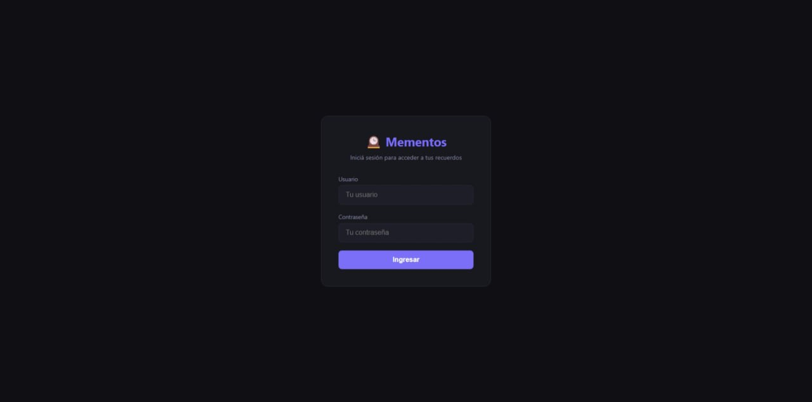
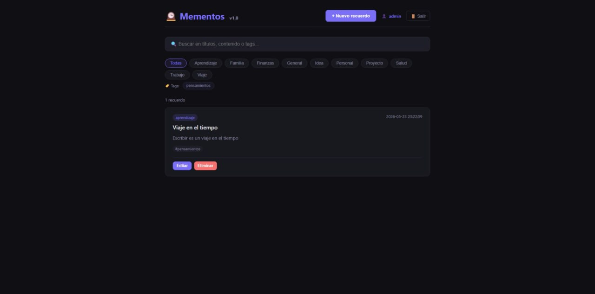
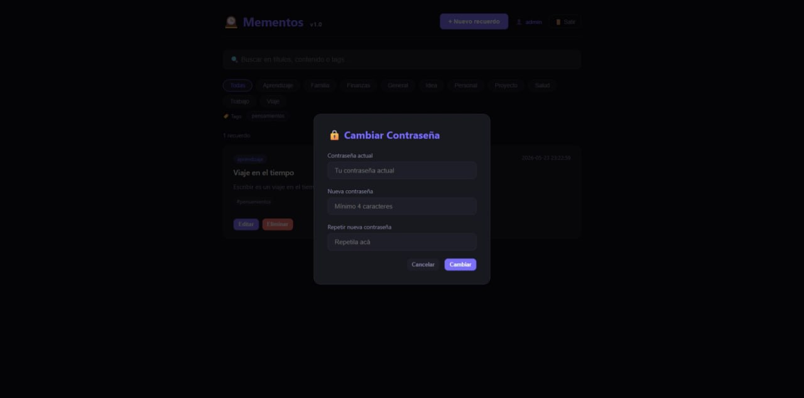
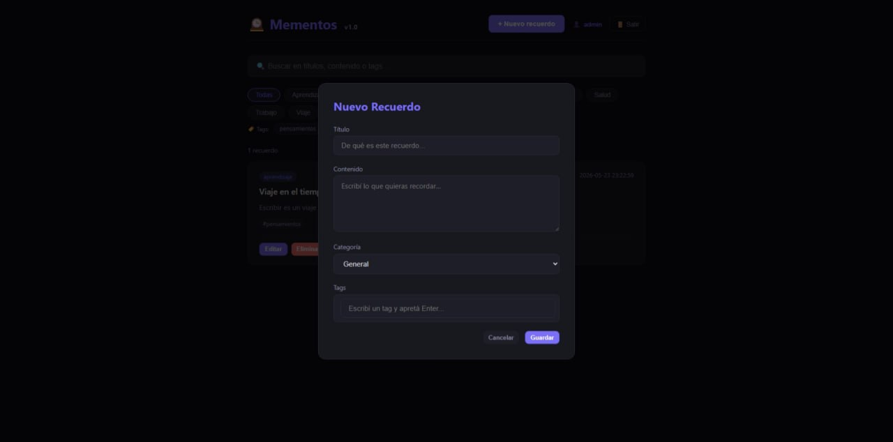
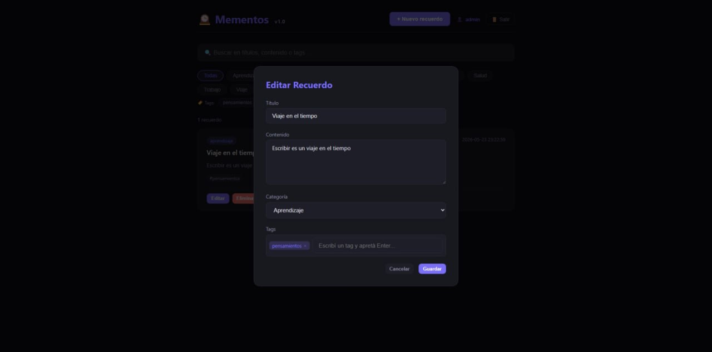

# 🕰️ Mementos

Sistema de gestión de recuerdos y memorias personales. Interfaz dark theme con tags, categorías, autenticación y filtros avanzados.

**Stack**: PHP 8.3 + SQLite + JS vanilla (sin dependencias externas)

**Acceso**: `http://192.168.100.214:8081/mementos`

## Características

- ✅ **CRUD completo** de recuerdos (título, contenido, categoría, tags)
- ✅ **Sistema de autenticación** con login/logout y sesiones PHP
- ✅ **Cambio de contraseña** desde el header (click en el nombre de usuario)
- ✅ **Tags interactivos**: chips visuales al editar, clickeables en las cards
- ✅ **Filtros múltiples**: por categoría + por tag + búsqueda libre (combinables)
- ✅ **Búsqueda en tiempo real** (títulos, contenido y tags)
- ✅ **Dark theme** responsive (mobile-first)
- ✅ **Sin dependencias externas** — PHP built-in server + SQLite
- ✅ **Toast notifications** para feedback de acciones

## Credenciales

| Usuario | Contraseña |
|---------|------------|
| admin   | mementos2026 |

> Para cambiar la contraseña: hacé click en el nombre de usuario en el header.

## Capturas de pantalla

### 🔐 Login



### 📋 Lista de recuerdos



### ✏️ Nuevo recuerdo con tags



### 🔒 Cambio de contraseña



### 🏷️ Tags como filtro



## Instalación

```bash
# Clonar
git clone https://github.com/EduardoCohen/mementos.git
cd mementos

# Iniciar servidor PHP
php -S localhost:8080

# Abrir en el navegador
# http://localhost:8080
```

O si ya tenés un servidor PHP corriendo, simplemente copiá la carpeta al document root.

## Estructura

```
mementos/
├── bootstrap.php      # Inicialización (DB + sesiones)
├── index.php          # Frontend (UI + JS) — protegido por auth
├── login.php          # Página de login
├── api.php            # API REST de recuerdos (CRUD)
├── api/
│   └── auth.php       # API de autenticación (login/logout/check/change_password)
├── classes/
│   └── Auth.php       # Clase de autenticación (bcrypt, sesiones)
├── mementos.db        # Base de datos SQLite (se crea automáticamente)
├── .gitignore
└── README.md
```

## Frontend (index.php)

| Archivo | Función |
|---------|---------|
| `bootstrap.php` | Define `getDB()`, `initDB()`, `session_start()`, crea tablas |
| `classes/Auth.php` | `login()`, `logout()`, `check()`, `requireAuth()`, `changePassword()` |
| `login.php` | Formulario de login (redirige a index si ya hay sesión) |
| `index.php` | App principal: redirige a login si no hay sesión, sino muestra la app |

### Ciclo de autenticación:

```
Usuario → GET /mementos/ → no hay sesión → /mementos/login.php
       → POST login → crea sesión → redirect a /mementos/
       → API del frontend lee/escribe con auth cookie
       → 401 → redirect a login
       → Click en username → modal cambio contraseña
       → Click en Salir → POST logout → redirect a login
```

## API

### Recuerdos (`api.php`)

Requiere autenticación (401 si no hay sesión).

| Método | Endpoint | Descripción |
|--------|----------|-------------|
| GET | `api.php?action=list` | Listar todos los recuerdos |
| GET | `api.php?action=list&search=texto` | Buscar (título, contenido, tags) |
| GET | `api.php?action=list&categoria=cat` | Filtrar por categoría |
| GET | `api.php?action=list&tag=tag` | Filtrar por tag |
| GET | `api.php?action=list&cat=X&tag=Y&search=Z` | Filtros combinados |
| GET | `api.php?action=get&id=1` | Obtener un recuerdo |
| POST | `api.php` `{action: "create/update/delete"}` | Mutaciones |

### Autenticación (`api/auth.php`)

| Método | Endpoint | Auth | Descripción |
|--------|----------|------|-------------|
| GET | `api/auth.php?action=check` | No | Verificar sesión |
| POST | `api/auth.php` `{action:"login"}` | No | Iniciar sesión |
| POST | `api/auth.php` `{action:"logout"}` | Sí | Cerrar sesión |
| POST | `api/auth.php` `{action:"change_password"}` | Sí | Cambiar contraseña |

### Payloads POST

```json
// Crear recuerdo
{
  "action": "create",
  "titulo": "Mi recuerdo",
  "contenido": "Descripción...",
  "categoria": "personal",
  "tags": "tag1, tag2"
}

// Actualizar
{
  "action": "update",
  "id": 1,
  "titulo": "Título editado",
  "contenido": "Contenido...",
  "categoria": "trabajo",
  "tags": "nuevo"
}

// Eliminar
{"action": "delete", "id": 1}

// Login
{"action": "login", "username": "admin", "password": "mementos2026"}

// Cambiar contraseña
{
  "action": "change_password",
  "current_password": "actual",
  "new_password": "nueva123"
}
```

## Base de datos

### Tabla `recuerdos`

| Campo | Tipo | Descripción |
|-------|------|-------------|
| id | INTEGER PK | Auto-increment |
| titulo | TEXT NOT NULL | Título del recuerdo |
| contenido | TEXT | Texto libre |
| categoria | TEXT | Default: 'general' |
| tags | TEXT | Separados por coma |
| creado | DATETIME | `datetime('now','localtime')` |
| modificado | DATETIME | Se actualiza en cada update |

### Tabla `usuarios`

| Campo | Tipo | Descripción |
|-------|------|-------------|
| id | INTEGER PK | Auto-increment |
| username | TEXT UNIQUE | Nombre de usuario |
| password_hash | TEXT | Hash bcrypt |
| nombre | TEXT | Nombre completo (default: '') |
| rol | TEXT | 'admin' u otros |
| activo | INTEGER | 1 = activo, 0 = deshabilitado |
| creado | DATETIME | Fecha de creación |

**Usuario por defecto**: `admin` / `mementos2026`

### Tabla `config`

| Campo | Tipo | Descripción |
|-------|------|-------------|
| clave | TEXT PK | Clave (ej: `cat_personal`) |
| valor | TEXT | Valor (ej: `personal`) |

Almacena categorías sugeridas. Se pobla automáticamente con 10 categorías default.

### Categorías por defecto

`general`, `trabajo`, `idea`, `personal`, `aprendizaje`, `proyecto`, `salud`, `finanzas`, `viaje`, `familia`

## Changelog

### v1.3 (2026-05-24)

- ✅ Username clickeable abre modal de cambio de contraseña
- ✅ Tags con chips visuales (Enter para agregar, × para quitar)
- ✅ Tags clickeables en cards → filtran recuerdos
- ✅ Barra de filtros por tags dinámica
- ✅ API soporta filtro `&tag=` combinado con categoría y búsqueda
- ✅ Header reorganizado: [+ Nuevo] [👤 admin] [🚪 Salir]
- ✅ Toast notifications para feedback

### v1.2 (2026-05-24)

- ✅ Sistema de autenticación completo (login/logout/sesiones)
- ✅ Tabla `usuarios` con bcrypt
- ✅ Clase `Auth` con `login()`, `logout()`, `check()`, `requireAuth()`, `changePassword()`
- ✅ `login.php` con formulario dark theme
- ✅ `api/auth.php` para endpoints de autenticación
- ✅ Fix ruta API en JS: `api.php` → `/mementos/api.php` (resolvía 404)
- ✅ `bootstrap.php` centraliza initDB + session_start
- ✅ Redirección automática a login cuando no hay sesión
- ✅ Redirect a login cuando API devuelve 401

### v1.0 (2026-05-23)

- ✅ Versión inicial: CRUD recuerdos, categorías, tags, búsqueda, dark theme

## Licencia

MIT

## Autor

<a href="https://eduardocohen.com" target="_blank" rel="noopener noreferrer">Eduardo Cohen</a> - 2026
